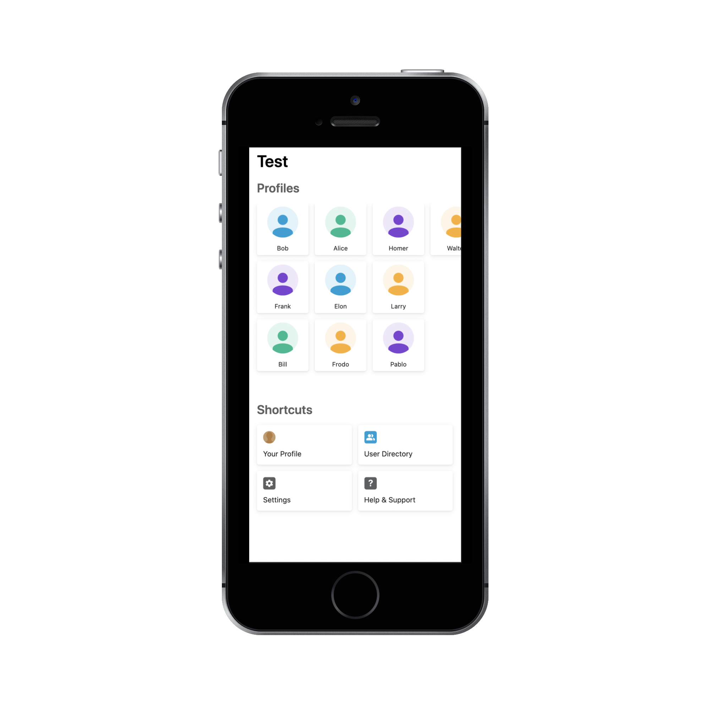

# Home Screen Example Widget

This is a guided example on how to develop a home screen widget. In this example we provide a working widget that uses the Beekeeper Javascript SDK to fetch 50 user profiles and display them in a grid layout.




For a more in depth overview on how the home screen is built and on how to set up the development environment please visit our [developer portal](https://developers.beekeeper.io/v2/welcome/home-screen). 

## Limitations

* The home screen only supports widgets developed using the [Vue 2](https://vuejs.org/) and [Vuex 3](https://vuex.vuejs.org/) frameworks.
 
If you are new to Vue.js please check out their [guide](https://vuejs.org/v2/guide/).

## Required Steps
 
1. Step 1: [Define Widget ID](src/Widget.vue#L19)
    ```javascript:title=home-screen-widget/src/Widget.js
    export const WIDGET_ID = 'profiles';
    ```
2. Step 2: [Register Widget Component](src/main.js#L20)
    ```javascript:title=home-screen-widget/src/main.js
    BeekeeperHomeScreen.registerWidget(WIDGET_ID, component)
    ```
3. Step 3: [Add widgetInstanceId Prop](src/components/Widget.vue#L38)
    ```javascript:title=home-screen-widget/src/Widget.js
    props: {
    widgetInstanceId: {
        type: String,
        required: true,
    },
    ```
4. Step 4: [Trigger LOADED Event](src/components/Widget.vue#L71)
    ```javascript:title=home-screen-widget/src/Widget.js
    import BeekeeperHomeScreen, { EventType } from '@beekeeper/home-screen-sdk';
    BeekeeperHomeScreen.triggerEvent(EventType.LOADED, this.widgetInstanceId);
    ```
5. Step 5: [Review vue.config.js](vue.config.js) for required WebPack configuration changes.

## Running the example widget

### Requirements

* [Node.js](https://nodejs.org/)
* [yarn](https://yarnpkg.com/getting-started/install)

### First time setup

```
yarn install
```

### Compiles and hot-reloads for development

```
yarn serve
```

### Compiles and minifies for production

```
yarn build
```

### Lints and fixes files

```
yarn lint
```

### Customize configuration
See [Configuration Reference](https://cli.vuejs.org/config/).
