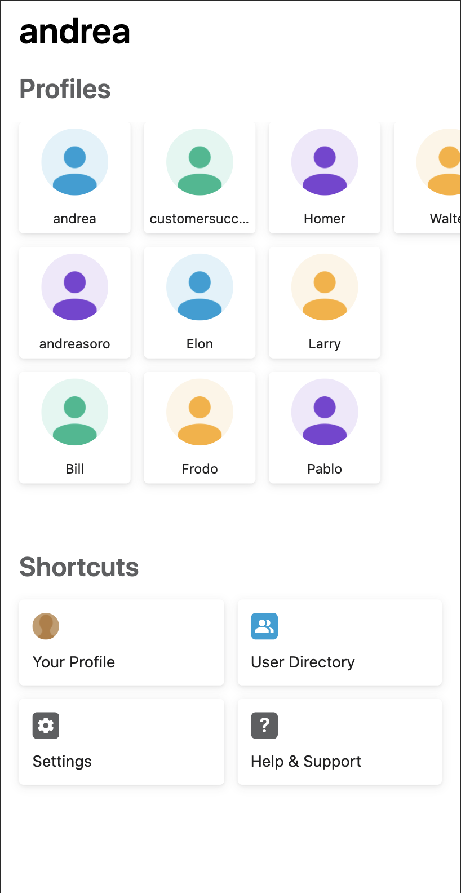

# Home Screen Example Widget

This is a guided example on how to develop a home screen widget.
In this example we provide a working widget that uses the Beekeeper Javascript SDK to fetch 50 user profiles and display
them in a grid layout.




For a more in depth overview on how the home screen is built and on how to set up the development environment
please visit our [developer portal](https://developers.beekeeper.io/v2/welcome/home-screen). 

## Limitations

* The home screen only supports widgets developed using the [Vue 2](https://vuejs.org/) and [Vuex 3](https://vuex.vuejs.org/) frameworks. 
If you are new to Vue.js please check out their [guide](https://vuejs.org/v2/guide/).

## Set up for Chrome

### Configure mock bridge when running in the Browser
When the home screen is run outside of the mobile app, the bridge needs extra setup to work. There is a helper script to do so:
```
$ npx run @beekeeper/mobile-bridge-setup --tenant-url https://<your_subdomain>.beekeeper.io/ --auth-token <auth_token>
```
Where `<your_subdomain>` is the tenant's subdomain and `<auth_token>` is a valid authentication token for a user. You can obtain it by going to inspecting the value of the `login` cookie on your test tenant's domain (`https://<your_subdomain>.beekeeper.io/`). 
To complete the setup, go to your test tenant, open the developer console, and paste the output of the script into it and hit enter to run it.

## Required Steps
 
1. Step 1: [Define Widget ID](components/Widget.vue#L19)
    ```javascript:title=home-screen-widget/components/Widget.js
    export const WIDGET_ID = 'profiles';
    ```
2. Step 2: [Register Widget Component](main.js#L9)
    ```javascript:title=home-screen-widget/main.js
    BeekeeperHomeScreen.registerWidget(WIDGET_ID, component)
    ```
3. Step 3: [Add widgetInstanceId Prop](components/Widget.vue#L38)
    ```javascript:title=home-screen-widget/components/Widget.js
    props: {
    widgetInstanceId: {
        type: String,
        required: true,
    },
    ```
6. Step 6:  [Trigger LOADED Event](components/Widget.vue#L71)
    ```javascript:title=home-screen-widget/components/Widget.js
    import BeekeeperHomeScreen, { EventType } from '@beekeeper/home-screen-sdk';
    BeekeeperHomeScreen.triggerEvent(EventType.LOADED, this.widgetInstanceId);
    ```

Note: Steps 4,5,7 are not mandatory for a basic widget. 

